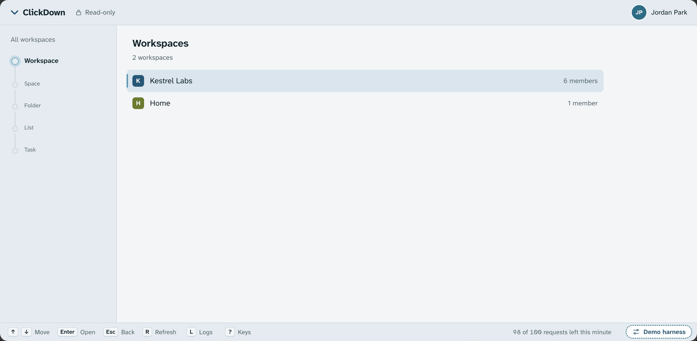
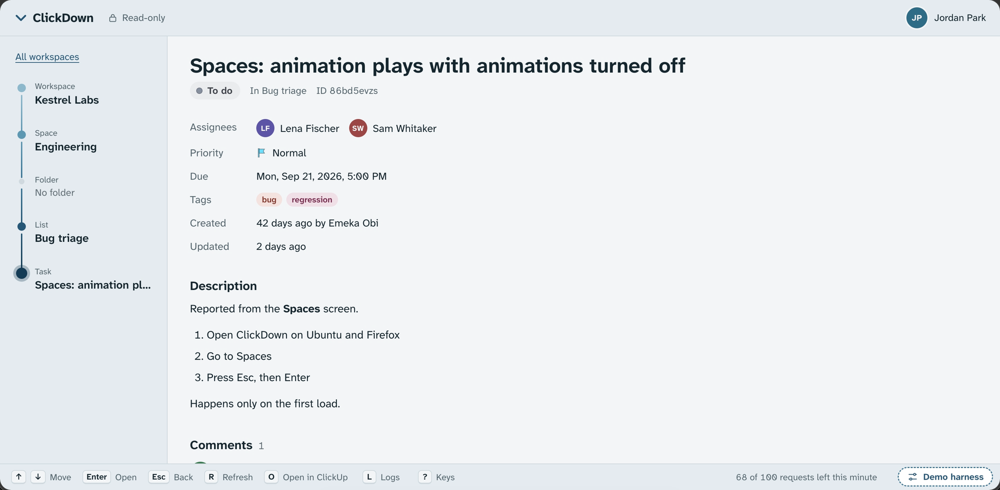

# ClickDown

A fast, read-only browser for ClickUp. Walk Workspace → Space → Folder → List → Task with the keyboard, read
descriptions, subtasks and comments, and never risk changing anything.





ClickDown has two halves:

- a small **Rust backend** (`src/ClickDown`) that holds your ClickUp token and talks to ClickUp with GET
  requests only;
- an **Angular UI** (`src/ClickDown.Angular`) that runs in your browser at http://127.0.0.1:4280 and only talks
  to the backend. It never sees the token.

The backend listens on 127.0.0.1 only, so nothing outside your machine can reach it. (The container image is
published on the host's 127.0.0.1 instead; see [Container image](#container-image).) To open it through a
reverse proxy or tunnel, see [Behind a reverse proxy](#behind-a-reverse-proxy).

## 1. Get a personal ClickUp token

In ClickUp, click your avatar → **Settings** → **Apps** → **API Token** → **Generate**. Copy the token (it
starts with `pk_`) and treat it like a password.

## 2. Create the config file

```sh
cd src/ClickDown
cp config.example.toml config.toml
```

Then edit `src/ClickDown/config.toml`. It's git-ignored, so your token stays out of git.

```toml
clickup_token = "pk_REPLACE_ME"    # ClickUp avatar → Settings → Apps → API Token → Generate
log_level = "info"                 # off | error | warn | info | debug | trace
log_file = "logs/clickdown.log"    # relative to this file's folder
animations = true
# only_lists = ["901234567"]       # optional, see below
# allowed_hosts = ["clickdown.example.com"]  # optional, see below
```

| key | meaning |
|---|---|
| `clickup_token` | your personal token (`pk_…`) |
| `log_level` | `off`, `error`, `warn`, `info`, `debug` or `trace` |
| `log_file` | where the log is written; a relative path is relative to the config file's folder |
| `animations` | `true` or `false`; `false` turns every animation off, including the splash (so does your system's reduced-motion setting) |
| `only_lists` | optional; ids of the only lists to show (see below) |
| `allowed_hosts` | optional; other names to answer, for a reverse proxy (see below) |

This file is the **only** place ClickDown gets settings from: no environment variables, no `.env`, no
command-line flags. It's read once at startup, so restart ClickDown after editing it. The first four keys are
required, `only_lists` and `allowed_hosts` are optional, and unknown keys are an error.

### Showing only some lists

Set `only_lists` to the ids of the lists ClickDown may show, e.g. `only_lists = ["901234567"]`. A list's id is
the part after `/li/` in its ClickUp URL (in ClickUp, right-click the list in the sidebar → Copy link). ClickDown
then opens on a short **Your lists** screen with just those lists. The backend enforces it: the Workspace, Space and
Folder levels are switched off, and lists, tasks and comments from other lists are refused. An id that can't be
loaded (a typo, a deleted list) gets its own row; open it to see why. After restarting ClickDown with a changed
`only_lists`, press `r` in an open page to start over at the right screen.

This is a filter, not a security boundary. Whoever can edit `config.toml` can remove it, and can read the token,
which has all of its owner's access. To really limit someone, invite them to ClickUp as a guest with access to
just that list and let them use their own token (with or without `only_lists`).

### Behind a reverse proxy

ClickDown only answers requests addressed to `127.0.0.1:4280` or `localhost:4280`, and refuses the rest with
`{"error":"forbidden"}`. That stops DNS rebinding: without it, any web page you visit could point its own domain
at 127.0.0.1 and read your ClickUp through your browser.

To open it through a reverse proxy or tunnel on this machine, have the proxy pass the browser's Host header
through (Caddy and cloudflared do by default; nginx needs `proxy_set_header Host $http_host;`) and list the names
you open it under, e.g. `allowed_hosts = ["clickdown.example.com"]`. Write each as the browser's address bar shows
it, with `:port` only if the address has one, and list only names whose DNS you control. Don't have the proxy
rewrite the Host header to `127.0.0.1:4280`: every name it answers would then look local, which turns this check
off. Every refused request is logged as a warning (log_level `warn` or more) with the host it asked for.

ClickDown has no login of its own: whoever can reach the proxy reads everything your token can. Put a login in
front of it, such as Cloudflare Access or the proxy's basic auth, before it faces the internet.

## 3. Run it

Prerequisites: Rust 1.97+ and Node 22.22+ (or 24.15+).

```sh
cd src/ClickDown.Angular
npm ci
npm run build        # builds the UI that the backend serves

cd ../ClickDown
cargo run
```

Then open http://127.0.0.1:4280. Stop the backend with Ctrl+C.

The terminal prints `Signed in as …` and then `ClickDown running at http://127.0.0.1:4280 (Ctrl+C to stop)`.
If `config.toml` is missing, still holds the placeholder token, or is invalid, ClickDown instead prints a friendly
message with the full path of the file to edit, and exits. If ClickUp rejects the token, the terminal
(`ClickUp rejected the token; edit … and restart`) and the UI both say so and point at that file.

## Keys

| key | action |
|---|---|
| ↑ / ↓ or `j` / `k` | move; in a task, scroll it |
| Page Up / Page Down | move ten rows; in a task, scroll a screen |
| Home / End | first or last row; in a task, its top or bottom |
| Enter or → | open |
| Esc, Backspace or ← | back |
| Tab | in a task, reach its subtasks (then ↑ / ↓ and Enter work on them) |
| `r` | refresh |
| `?` | show or hide the keys |

There are **no editing actions**. To change something, edit it in ClickUp.

The rail on the left shows where you are, Workspace → Space → Folder → List → Task; click a level to go back to
it. The status bar at the bottom shows the keys, whether a request is under way or ClickUp can't be reached, and
how many ClickUp requests are left this minute (from the rate-limit headers ClickUp sends with every answer;
hidden in narrow windows).

Folders and lists that someone shared with you directly (ClickUp's **Shared with me**) appear after the Spaces
in their Workspace, under *Shared with you*. You can open them even if you can't open the Space they live in.

Lists show their open tasks grouped by status, 100 at a time ("Load more tasks"), and leave out closed tasks and
subtasks, as ClickUp does by default; a task's subtasks appear in its detail view. Comments read oldest first
and load 25 at a time ("Load older comments"). If ClickUp rate-limits you, a banner and the status bar count
down and ClickDown retries by itself.

## Logs

With the example config, the log goes to `src/ClickDown/logs/clickdown.log` (change it with `log_file`) and is
appended across runs. It records startup versions, the config that was loaded, every ClickUp call
(`GET /list/123/task page=0 → 200 in 182 ms`), rate-limit waits, and errors with backtraces.

The token is never logged. Where it has to appear, it's masked, like `pk_12…9xyz`. Errors in the browser only
show up in the browser's developer console.

## Development

Run the backend and the Angular dev server side by side:

```sh
cd src/ClickDown && cargo run               # terminal 1
cd src/ClickDown.Angular && npx ng serve    # terminal 2
```

Open http://localhost:4200. It live-reloads and proxies `/api` to the backend on port 4280 (`proxy.conf.json`).

Tests:

```sh
cd src/ClickDown && cargo test
cd src/ClickDown.Angular && npx ng test --watch=false
```

`cargo clippy --all-targets -- -D warnings` and `npm run build` must stay warning-free. `CLAUDE.md` lists the
project's rules (read-only, one config file, simple architecture).

The UI uses the Atkinson Hyperlegible Next and Atkinson Hyperlegible Mono fonts (Latin subsets), licensed under
the SIL Open Font License 1.1 and shipped as woff2 files in `src/ClickDown.Angular/public/fonts`.

## Container image

`.github/workflows/package.yml` runs the checks above, then builds a container image for amd64 and arm64 and
pushes it to GitHub Packages as `ghcr.io/<owner>/<repo>`. That happens on every push to `main` and on `v*`
tags, which get `latest` (on `main`), the branch name, `sha-<commit>` and the version. Pull requests are
checked and built, but nothing is pushed. A new package on ghcr.io starts out private: make it public in its
package settings, or run `docker login ghcr.io` before pulling.

No source code goes into the image, or even reaches Docker: the workflow compiles the binary and builds the
UI first, and the image is made from just those two. They are the same as a local build, so the same rules
apply, but one: the binary is built with the `container` feature and listens on 0.0.0.0:4280 inside its
container, because Docker forwards a published port to the container's network interface, not to its
loopback. It reads its settings only from `config.toml`, which you mount; the image never contains it.
Publish the port on the host's 127.0.0.1 only:

```sh
docker run --rm -p 127.0.0.1:4280:4280 \
  -v "$PWD/src/ClickDown/config.toml:/opt/clickdown/ClickDown/config.toml:ro" \
  -v clickdown-logs:/opt/clickdown/ClickDown/logs \
  ghcr.io/<owner>/<repo>:latest
```

Then open http://127.0.0.1:4280. Keep the `127.0.0.1:` in `-p`: a bare `-p 4280:4280`, or `--network host`,
would offer ClickDown, and with it everything your token can read, to your whole network. Keep the host port
4280 too, since ClickDown only answers requests addressed to 127.0.0.1:4280 or localhost:4280. Keep `log_file`
relative, like the example's `logs/clickdown.log`; the log then lands in the `clickdown-logs` volume. Stop it with
Ctrl+C or `docker stop`.

On Linux, use Docker Engine 28.0 or newer (or rootless Docker): older engines let other machines on your network
reach a container's published port, even one published on 127.0.0.1. Docker Desktop (macOS, Windows) is fine.

## Troubleshooting

- **"Port 4280 is in use; is ClickDown already running?"** Another ClickDown, or some other program, has the
  port. The port is fixed, so stop that program (`lsof -i :4280` shows what it is) and run `cargo run` again.
- **"UI not built".** The backend serves the UI from `src/ClickDown.Angular/dist/clickdown-angular/browser`. Run
  `npm ci && npm run build` in `src/ClickDown.Angular`, then reload the page; no restart is needed.
- **"ClickDown server isn't running"** in the browser. Start the backend with `cargo run` in `src/ClickDown`,
  then press `r`.
- **Token rejected.** Generate a new token in ClickUp, paste it into `config.toml`, and restart `cargo run`.
- **npm crashes with `Cannot read properties of null (reading 'edgesOut')`** when adding or removing packages.
  That's an npm 10 bug. Use npm 11 for dependency changes, e.g. `npx -y npm@11 install <package>`.
  Plain `npm ci` works fine with npm 10.
